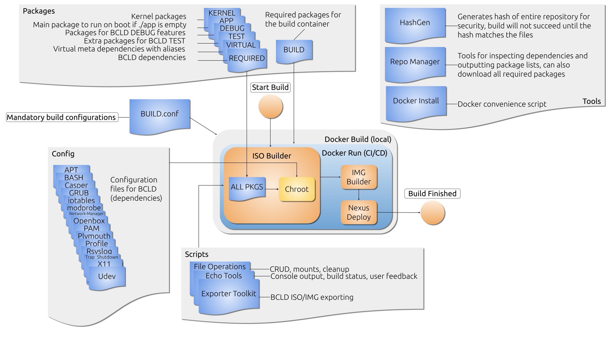

# Introduction
This is BCLD (Bootable Client Lockdown).
This project is a follow-up to the Fedora BCLD project.
BCLD was initiated in hopes of advancing hardware support and being able to operate in accordance with Secure Boot.
Below is an extensive manual of the product.

**BCLD Version**: 13.6-4 BCLD (Gargoyle)

**BCLD Kernel**: 6.2.0-39-generic

# Index
1. [System Requirements](#system-requirements)
2. [Repository](#repository)
3. [BCLD Models](#bcld-models)
4. [ISO-builder](#iso-builder)
5. [IMG-builder](#img-builder)
6. [Docker-builder](#docker-builder)
7. [Initialization](#initialization)
8. [Configurations](#configurations)
9. [Package Lists](#package-lists)
10. [Bootstrap](#bootstrap)
11. [Chroot](#chroot)
12. [Chrome Apps](#chrome-apps)
13. [Image](#image)
14. [Scripts](#scripts)
15. [Versioning](#versioning)
16. [Artifacts](#artifacts)
17. [BCLD-USB](#bcld-usb)
18. [Logging](#logging)
19. [Debugging](#debugging)
20. [Testing](#testing)
21. [Firewall](#firewall)
22. [Tools](#tools)
23. [Update ISOlinux](#update-isolinux)
24. [BCLD Flow Chart](#bcld-flow-chart)
25. [ISO Builder Flow Chart](#iso-builder-flow-chart)
26. [Known Bugs](#known-bugs)
27. [License](#license)
28. [Changelog](#changelog)

# System Requirements

|            | Minimum   | Recommended |
| ----------:|:---------:|:-----------:|
| **CPU**    | Dual Core | Quad Core   |
| **Memory** | 4GB       | 8GB         |
| **USB**    | 2GB       | 2GB         |

# Repository
This repository consists of the following objects:
  1. `artifacts` - This folder is created during the build and contains usable artifacts.
  2. `chroot` - This folder is created during the build and contains the BCLD file system.
  3. `config` - This folder contains all configurable aspects of BCLD.
  4. `deb` - This folder can be created for vendor packages for BCLD (Facet, WFT, Default).
  5. `image` - This folder is used for building the BCLD images (ISO, IMG).
  6. `log` - This folder is created during the build and contains important logs.
  7. `opt` - Everything in this folder will be copied to the BCLD file system.
  8. `script` - This folder contains important scripts for BCLD.
  9. `tools` - This folder contains associated tools, such as `RepoMan`.
  10. `.gitignore` - This file contains a list of files and artifacts that must be excluded from the repository.
  11. [BCLD_FLOW.png](./assets/BCLD_FLOW.png) - Overview of the build process.
  12. [CHANGELOG](./CHANGELOG) - Changelog.
  13. [IMG-builder.sh](./IMG-builder.sh) - This script is responsible for the generation of the IMG-file during the build process and can be used on its own (as long as there is a `./artifacts/bcld.iso`).
  14. [ISO-builder.sh](./ISO-builder.sh) - This script is responsible for the build process.
  15. [RepoMan.sh](./RepoMan.sh) - `RepoMan` is the repository management tool for BCLD.

## Git Ignore List
* The [.gitignore](./.gitignore) file consists mainly of artifacts and subfiles that are created during the build process.
* These files do not need to be kept.
* This includes the entire `./chroot` folder.

## Git Modules
* BCLD inherits the following modules:
  1. `bats-core`
  2. `bats-support`
  3. `bats-assert`

# BCLD Models

| **BCLD_MODEL** | **Explanation**                                                                                                                                                                                              |
| -------------- | ---------------------------------------------------------------------------------------------------------------------------------------------------------------------------------------------------------- |
| **Release**    | The BCLD Release images are provided with a kiosk mode that cannot be escaped.                                                                                                                             |
| **Debug**      | Debug images have an exposed port for PixelHunter (Chromium Debugging). Kiosk mode is disabled.                                                                                                            |
| **Test**       | Test images are not distributed and are intended for internal usage only. Additional firewall rules have been added to enable SSH and X11 forwarding for log offloading. The app won't boot automatically. |

# ISO-builder
* This repo can be used on an Ubuntu build agent (VM).
* Preferably a machine with the same release (`22.04`,`jammy`).
* Use [ISO-builder.sh](./ISO-builder.sh) to build an image.
* This requires the tools from `./config/packages/BUILD`.
* Installing tools: `apt-get install -y $(cat config/packages/BUILD)`.

# IMG-builder
* The bcld.iso file can be packed into a filesystem BCLD-IMG.
* To do this, start [IMG-builder.sh](./IMG-builder.sh).
* The BCLD-IMG file will be generated and a Secure Boot signed Grub2 will be installed.

# Docker-builder
* It is also possible to run both [ISO-builder.sh](./ISO-builder.sh) and [IMG-builder.sh](./IMG-builder.sh) inside Docker.
* For this script to work, Docker must be installed.
* This script will automatically attempt to install Docker after prompting the user.


# Initialization
* The BCLD build process starts by checking for mounts.
* These mounts are then detached to prevent further errors.
* Many devices are mounted during the build process, for network configuration, image assembly, IMG file partitioning and formatting, etc.
* If the build process crashes, mounts can sometimes hang and cause errors.
* That's why BCLD cleans it up at the beginning of the process, instead of at the end (as it used to be with Fedora).
* During the first build, non-existent folders will be automatically generated, such as `artifacts`, `chroot` and `log`.
* If the above directories already exist, they will be emptied for a clean build.

| DIR         | Description                                                                                                                          |
| ----------- | ------------------------------------------------------------------------------------------------------------------------------------ |
| _artifacts_ | This folder contains post-build artifacts, such as generated package reports, archives, and image files.                             |
| _chroot_    | This directory contains the output of `debootstrap` or `Ubuntu Base`. It then installs packages from the lists in `config/packages`. |
| _log_       | Log output is written to this directory during a build.                                                                              |

# Configurations 
### `./config`
* These files are freely editable and will be transferred to the new system during the build.
* BCLD can be completely configured using the following file and directories:
	1. `apt`: Configurations for the download mirrors and repositories.
	2. `bash`: Configurations for the build environment.
	3. `casper`: Configurations for the Casper live boot system.
	4. `grub`: Configurations for starting the boot loader.
	5. `iptables`: Configure the firewall settings.
	6. `modprobe`: Configurations for kernel modules (drivers).
	7. `network-manager`: Network configurations.
	8. `nssdb`: Configure the NSS database.
	9. `openbox`: Configurations for auto-launching the Chrome App.
	10. `packages`: Lists of packages required for BCLD.
	11. `plymouth`: Configurations for the splash screen.
	12. `systemd`: Configurations for automatic services.
	13. `udev`: Configure device rules.
	14. `usbmount`: Configure USB-mounting.
	15. `X11`: Configurations for the X screen management system.
	16. [BUILD.conf](./config/BUILD.conf): This file contains important build variables for customization, such as which kernel version to use.

## Build Configuration

### `./config/BUILD.conf`

| CONFIG                | SETTING EXAMPLE                                                                                    | DESCRIPTION                                                                         |
|:--------------------- | -------------------------------------------------------------------------------------------------- | ----------------------------------------------------------------------------------- |
| **BUILD ENVs**        |                                                                                                    |                                                                                     |
| `APT_CLEANUP`         | true/false                                                                                         | Option to clean chroot after installation.                                          |
| `BCLD_APP`            | /opt/deb-app-afname                                                                                     | Full path of the application to launch.                                                      |
| `BCLD_ARCH`           | amd64                                                                                              | Architecture of the distribution used.                                              |
| `BCLD_CODE_NAME`      | Omniscius                                                                                          | Codename for the BCLD release.                                                      |
| `BCLD_DATE`           | 14-dec-2022                                                                                        | Date prefix for file name.                                                          |
| `BCLD_HOME`           | /root                                                                                              | Path to ${HOME} within chroot.                                                      |
| `BCLD_MD5`            | ./test/bcld.md5                                                                                    | Location of BCLD MD5 within repository.                                             |
| `BCLD_MODEL`          | release, debug, test                                                                               | Option for switching between modes.                                                 |
| `BCLD_PATCH`          | 1                                                                                                  | BCLD patch number.                                                                  |
| `BCLD_PKG_EXTRA`      | r8168-dkms                                                                                         | Extra packages to install.                                                          |
| `BCLD_RELEASE`        | 11.X                                                                                               | BCLD release number.                                                                |
| `BCLD_REPO_BRANCH`    | main                                                                                               | Dummy repo name.                                                                    |
| `BCLD_SECRET`         | ************                                                                                       | SSH password for TEST.                                                              |
| `BCLD_TAG_EXTRA`      | r8168                                                                                              | Adds postfix to `BCLD_VERSION`.                                                     |
| `BCLD_TERM`           | xterm-256color                                                                                     | BCLD terminal settings.                                                             |
| `CODE_NAME`           | focal, bionic                                                                                      | Ubuntu Release Code Name                                                            |
| `DEBIAN_FRONTEND`     | noninteractive                                                                                     | Use autonomous installers.                                                          |
| `DEBIAN_PRIORITY`     | critical                                                                                           | Critical packages can be installed without interaction.                             |
| `FAT_LABEL`           | BCLD-USB                                                                                           | BCLD disk label.                                                                    |
| `HOME`                | /root                                                                                              | Path to ${HOME} on build machine.                                                   |
| `KEEP_BOOTSTRAP`     | true, false                                                                                        | The build either keeps the bootstrap, or deletes it before the next build          |
| `KERNEL_MINOR`        | 5.15                                                                                               | Minor kernel release.                                                               |
| `KERNEL_MODEL`        | generic                                                                                            | Kernel model name.                                                                  |
| `KERNEL_PATCH`        | 0-40                                                                                               | Kernel patch and release.                                                           |
| `LC_ALL`              | C                                                                                                  | Universal language settings for the console.                                        |
| `TEMP`                | /tmp                                                                                               | Temporary folder                                                                    |
| `TMP`                 | /tmp                                                                                               | Temporary folder                                                                    |
| `TMPDIR`              | /tmp                                                                                               | Temporary folder                                                                    |
| `UBUNTU_RELEASE`      | 22.04                                                                                              | Ubuntu release.                                                                     |
| `UBUNTU_REPO`         | http://archive.ubuntu.com/ubuntu/                                                                  | Official Ubuntu repository.                                                         |
| `UBUNTU_URL`          | http://cdimage.ubuntu.com/ubuntu-base/releases/20.04/release/ubuntu-base-20.04.1-base-amd64.tar.gz | Ubuntu Base image URL.                                                              |
| `WEB_DIR`             | /var/www/html                                                                                      | Web directory for RepoMan.                                                          |
|                       |                                                                                                    |                                                                                     |
| `BCLD_USER`           | omniscius-release                                                                                  | Username within BCLD. Consists of combination of `BCLD_CODE_NAME` and `BCLD_MODEL`. |
| `KERNEL_SHORT`        | 5.15-0-40                                                                                          | Short kernel name. Combination of `KERNEL_MINOR` and `KERNEL_PATCH`.                |
| `KERNEL_VERSION`      | 5.15-0-40-generic                                                                                  | Long kernel name. Combination of `KERNEL_SHORT` and `KERNEL_MODEL`.                 |
| `BCLD_VERSION_FILE`   | 14-dec-2022_BCLD-Omniscius-3_TEST.img_`BCLD_TAG_EXTRA`                                             | Full VERSION string for file names.                                                 |
| `BCLD_VERSION_STRING` | 12.10-3 BCLD Test (Omniscius)                                                                      | Concatenated VERSION string for human reading.                                      |


## BCLD Configuration

* When a BCLD image is written to a USB, a file called `bcld.cfg` is generated.
* This file can be used to configure BCLD.
* The following parameters are made available:

| #   | PARAMETER                        | EXPLANATION                                                     | TYPE                    | VOORBEELD / DEFAULT                                                                                              |
|:---:| -------------------------------- | --------------------------------------------------------------- |:-----------------------:| ---------------------------------------------------------------------------------------------------------------- |
|     | **GENERAL**                      |                                                                 |                         |                                                                                                                  |
| 1   | bcld.afname.mouse                | Bigger mouse cursor.                                            | *BIT*                   | **0**, 1                                                                                                         |
| 2   | bcld.afname.url                  | Web site target                                                 | *URL*                   | https://www.google.com/                                                                               |
| 3   | bcld.afname.verbose              | Increase verbosity                                              | *BIT*                   | **0**, 1                                                                                                         |
|     |                                  |                                                                 |                         |                                                                                                                  |
|     | **DISPLAY**                      |                                                                 |                         |                                                                                                                  |
| 4   | bcld.display.brightness          | Brightness                                                      | *PERCENTAGE*            | 10 - **100**                                                                                                     |
| 5   | bcld.display.preset              | Dimensional presets:                                            | *PRESET*                | - 4K (UHDTV met HDPI)<br/> - 1080p (Full HD)<br/> - HD+ (1600×900)<br/> - 768p (1368x768)<br/> - XGA (1280x1024) |
| 6   | bcld.display.resolution          | Resolution                                                      | *RESOLUTION*            | 1280x1024, 1368x768, 1600×900, 1920x1080                                                                         |
| 7   | bcld.display.rotate              | Rotation                                                        | *STRING*                | left, right, **normal**, inverted                                                                                |
| 8   | bcld.display.scale_factor        | Scaling                                                         | *PERCENTAGE*            | 10 - 200, **100**                                                                                                |
|     |                                  |                                                                 |                         |                                                                                                                  |
|     | **AUDIO**                        |                                                                 |                         |                                                                                                                  |
| 9   | bcld.audio.alsa_port             | Port Name                                                       | *PERCENTAGE*            | 10 - **100**                                                                                                     |
| 10  | bcld.audio.alsa_sink             | Sink Name                                                       | *PERCENTAGE*            | 10 - **150**                                                                                                     |
| 11  | bcld.audio.default_playback_vol  | Output Volume                                                   | *PERCENTAGE*            | 10 - **100**                                                                                                     |
| 12  | bcld.audio.default_recording_vol | Recording Volume                                                | *PERCENTAGE*            | 10 - **150**                                                                                                     |
| 13  | bcld.audio.default_sink          | Default audio output device                                     | *DEVICE INDEX*          | 1, 2, ...                                                                                                        |
| 14  | bcld.audio.default_source        | Default audio input device                                      | *DEVICE INDEX*          | 1, 2, ...                                                                                                        |
| 15  | bcld.audio.restore               | Set ALSA Restore                                                | *BIT*                   | **0**, 1                                                                                                         |
| 16  | bcld.audio.use_combined_sink     | Combined audio devices                                          | *BIT*                   | **0**, 1                                                                                                         |
|     |                                  |                                                                 |                         |                                                                                                                  |
|     | **NETWORK**                      |                                                                 |                         |                                                                                                                  |
| 17  | bcld.default.interface           | Standard network adapter                                        | *INTERFACE*             | enp0s1                                                                                                           |
| 18  | bcld.realtek.driver              | Selected Realtek driver                                         | *KERNEL MODULE*         | r8168                                                                                                            |
| 19  | bcld.wifi.eap.auth               | Wi-Fi EAP authentication method                                 | *AUTHENTICATION METHOD* | mschap, **mschapv2**                                                                                             |
| 20  | bcld.wifi.eap.method             | Wi-Fi EAP method                                                | *EAP METHOD*            | tls, ttls                                                                                                        |
| 21  | bcld.wifi.eap.user               | Wi-Fi user (with domain) for EAP                                | *BASE64 USER[@DOMAIN]*  | jan, jan@duo.nl                                                                                                  |
| 22  | bcld.wifi.eap.password           | Wi-Fi password for EAP                                          | *BASE64 PASSWORD*       | bm90aGluZ2J1dHVzY2hpY2tlbnMK                                                                                     |
| 23  | bcld.wifi.psk                    | Wi-Fi password                                                  | *BASE64 STRING*         | bm90aGluZ2J1dHVzY2hpY2tlbnMK                                                                                     |
| 24  | bcld.wifi.ssid                   | Wi-Fi name                                                      | *BASE64 SSID*           | RG9udFRyeWl0QW5ha2luCg==                                                                                                 |
| 25  | bcld.wol.disable                 | Wake-on-LAN                                                     | *BIT*                   | **0**, 1                                                                                                         |
| 26  | bcld.wwan.enable                 | 4G, 5G, LTE                                                     | *BIT*                   | **0**, 1                                                                                                         |
|     |                                  |                                                                 |                         |                                                                                                                  |
|     | **KERNEL**                       |                                                                 |                         |                                                                                                                  |
| 27  | acpi                             | Advanced Configuration and Power Interface                      | *SWITCH*                | **on**, off                                                                                                      |
| 28  | ipv6.disable                     | Disable IPv6 networking                                         | *BIT*                   | **0**, 1                                                                                                         |
| 29  | nomodeset                        | Instruction to leave the kernel's mode setting to the firmware. | KERNEL PARAM            | nomodeset                                                                                                        |
| 30  | nouveau.modeset                  | Allows kernel from loading video driver                         | *BIT*                   | 0, **1**                                                                                                         |
| 31  | snd_hda_intel.dmic_detect        | Enables integrated microphone detection to force audio.         | *BIT*                   | 0, **1**                                                                                                         |


# Package Lists
## `./config/packages`
* BCLD contains a number of package lists:
  1. [DEBUG](./config/packages/DEBUG): Contains additional debug packages.
  2. [KERNEL](./config/packages/KERNEL): Contains the necessary kernel packages.
  3. [REMOVE](./config/packages/REMOVE): Contains packages that will be excluded.
  4. [REQUIRED](./config/packages/REQUIRED): Contains all necessary packages.
  5. [TEST](./config/packages/TEST): Contains extra packages for tests.
  6. [VIRTUAL](./config/packages/VIRTUAL): Contains virtual packages for RepoMan.

# Bootstrap
* BCLD uses `debootstrap` to generate a clean environment:
   - Debootstrap handles a completely fresh Debian-like file system.
   - BCLD is built on top of said file system.
* The setting can be found under [BUILD.conf](./config/BUILD.conf).

# Chroot 
## `./chroot` & `./script/chroot.sh`
* After the bootstrap is complete, the [ISO-builder.sh](./ISO-builder.sh) script performs chroot operations within the file system.
* The new environment can then be found within `./chroot`.
* The script that will be executed within this environment can be found in [chroot.sh](./script/chroot.sh).
* You can install various packages through chroot to shape BCLD.
* When chrooted into the new file system, there will be package lists ready in the home directory.
* These will be cleaned up afterwards.
* Within this new environment, all packages are merged, excluding the [REMOVE](./config/packages/REMOVE) packages.
* Then these packages are installed, this is a long process.
* All steps are written to `log/chroot.log`.
* Package installations are written to `log/APT.log`.

# Chrome Apps
## `./deb` (`/opt`)
* The BCLD repository contains two special directories: `./deb` and `./opt`:
* All files in `./deb/RELEASE` are installed in the process.
* `./deb/DEBUG` is only used for debug builds.
* All files in `./opt` are simply copied to the `/opt` directory within BCLD.

# Image
## `./image`
* This folder contains a conversion of `./chroot` into usable LiveCD files.
* The `./chroot` file system is used to build a LiveCD.
* This is especially done with the following files:
     1. `./image/ISO/casper/`
         - `filesystem.squashfs`: This file is a compressed file system and will be used within the ISO file. `./chroot/boot` is excluded here, because the kernel and RAMFS are loaded via Casper (`./image/ISO/casper`).
         - `initrd`: This is a 'normal' initrd, a small file containing a recording of the RAM file system.
         - `vmlinuz`: This is ultimately the kernel used within BCLD.
     2. `./image/ISO/EFI/BOOT/efi.img`: This is the EFI boot IMG file and contains the boot loader that makes the ISO bootable.
     3. `./image/ISO/.disk`: This folder contains some meta information about the ISO.
     4. [bcld.cfg](./config/bcld/bcld.cfg): A BCLD configuration file will be generated during the build process.

# Scripts
## `./script`
This folder contains important scripts for building a BCLD image.

1. [autocert.sh](./script/autocert.sh) automatically selects the right certificate for the `BCLD_VENDOR`.
2. [bcld_app.sh](./script/bcld_app.sh) uses `Xconfigure.sh` and `Xlogger.sh` to simplify Autostart with Openbox.
3. [bcld_test.sh](./script/bcld_test.sh) are BCLD TEST tools.
4. [chroot.sh](./script/chroot.sh) is only executed within BCLD's new `chroot` environment and mainly consists of installing packages and making configurations.
5. [client_logger.sh](./script/client_logger.sh) uses `log_tools.sh` to log the BCLD client.
6. [crosdump_logger.sh](./script/crosdump_logger.sh) attempts to output Chromium dump files to the journal.
7. [docker_tools.sh](./script/docker_tools.sh) is for local building with Docker.
8. [echo_tools.sh](./script/echo_tools.sh) is responsible for console output.
9. [file_operations.sh](./script/file_operations.sh) takes care of file management and permissions.
10. [log_tools.sh](./script/log_tools.sh) is a script with useful logging functions that can be included in multiple scripts.
11. [param_switcher.sh](./script/param_switcher.sh) is included in `test` builds and is a script for turning `BCLD_AUTOSTART` on and off when debugging boot problems.
12. [rsyslogger.sh](./script/rsyslogger.sh) takes care of remote logging.
13. [startup.sh](./script/startup.sh) is run every time BCLD starts and includes setting up BCLD before each use. This processes boot parameters.
14. [usb_logger.sh](./script/usb_logger.sh) uses `log_tools.sh` to write the journal to `BCLD-USB`.
15. [Xconfigure.sh](./script/Xconfigure.sh) is used by Openbox, before launching the Chrome app, to configure the X screen management system.
16. [Xlogger.sh](./script/Xlogger.sh)  uses log_tools.sh to log activities on the X server.

### USB Logger
* The BCLD USB Logger uses a service that starts a process which then checks for 'BCLD-USB'.
* If `bcld.log` is found on `BCLD-USB`, logging will be written to it.
* This only works on a USB stick with a `BCLD-USB` label, if it also has `bcld.log` on it.
* It also only works once, so `BCLD-USB` may not be disconnected if logging has started.

# Versioning
* As with Fedora BCLD, the version number is kept in a file called `./VERSION`.
* This can be configured in [BUILD.conf](./config/BUILD.conf).
* So use helpful, concise descriptions like: `14-dec-2022_BCLD-Omniscius-3_FACET-TEST.img`
* <mark>NEVER USE SLASHES:</mark> These are used in Bamboo to distinguish between branches.
* The `VERSION` file contains a concatenated string: `12.10-3 BCLD Test (Omniscius)`.

# Artifacts
A BCLD build produces the following artifacts:

1. `./artifacts/${BCLD-VERSION}.img`: The ISO file is packed into an IMG file so that users can get a writable partition for `bcld.cfg`.
2. `./artifacts/bcld.cfg`: Template with `VERSION`.
3. `./artifacts/bcld.iso`: The ISO file, usable on hypervisors. BCLD hereby has a bare configuration that is overwritten by the IMG file.
4. `./artifacts/info`: Description of the ISO file.
5. `./artifacts/BATS-REPORT`: The results of the Bash Automated Tests.
6. `./artifacts/BATS-SUCCESS`: Placeholder to tell CI/CD that BATS was successful.
7. `./artifacts/BCLD_REPO.tar.gz`: The BCLD repository (archive) that RepoMan generates.
8. `./artifacts/PKGS.md`: The list of packages that RepoMan inspects.
9. `./artifacts/PKGS_ALL`: List of all packages selected for installation.

# BCLD-USB
* To flash BCLD, it is recommended to use [Startup Disk Creator](https://ubuntu.com/tutorials/create-a-usb-stick-on-ubuntu#1-overview) on Ubuntu. 
* If not available, use [Etcher](https://etcher.balena.io/) (Linux) or [Rufus](https://rufus.ie/) (Windows).
* Other programs such as [UNetBootin](https://unetbootin.github.io/) and [mkusb](https://help.ubuntu.com/community/mkusb/gui) do not work optimally and have been known to cause issues.
* Write the IMG file to a USB.
* If desired, modify the `bcld.cfg` on the USB.
* Check if UEFI and Secure Boot are enabled on the machine.
* Boot the machine from USB in Legacy, UEFI or Secure Boot mode.

# Logging
* Logging in BCLD works similarly to previous releases: by writing the IMG file to a USB, and creating a file called `bcld.log` in the root of the disk.
* BCLD will only write logging to this file if it exists.
   - The idea is that logging is the only reason not to unplug the USB.
   - Normally BCLD works entirely in memory.
   - By performing this check, BCLD knows that another USB disk is connected for transporting the log files.

## Tags
The BCLD log file is generated from the journal and provides the following tags:

| TAG                 | Description                                              |
| ------------------- | -------------------------------------------------------- |
|                     |                                                          |
| `BUILD` **TAGs**    | _These TAGs contain information about the build process_ |
|                     |                                                          |
|                     | **ISO Builder**                                          |
| **ISO-INIT**      | Initialization                                           |
| **ISO-PRECLEAN**  | Cleanup                                                  |
| **ISO-PREP**      | Preparations                                             |
| **ISO-BOOTSTRAP** | Ubuntu file system initialization                        |
| **ISO-PRECONF**   | Preconfigurations                                        |
| **ISO-CROS**      | Installing the Chrome app                                |
| **ISO-MOUNT**     | Handling mounts                                          |
| **ISO-CHROOT**    | Handling installations within the client                 |
| **ISO-POSTCONF**  | Post-install configurations                              |
| **ISO-INITRAMFS** | Generating the initial memory system                     |
| **ISO-REPO**      | Generation of the dummy repo                             |
| **ISO-SQUASHFS**  | Generation of the compressed file system                 |
| **ISO-GRUB**      | Installing the file system boot loader                   |
| **ISO-GEN**       | Generation of the BCLD-ISO                              |
|                     |                                                          |
|                     | **IMG Builder**                                          |
| **IMAGE-INIT**       | Generation of the BCLD-IMG                              |
| **IMAGE-GRUB**      | Installing the bootloader on the image                   |
| **IMAGE-BUILD**      | Copy BCLD files to the image                            |
|                     |                                                          |
|                     | **BCLD Tools**                                          |
| **BUILD-PXE**       | Upload artifacts to PXE                                  |
| **BUILD-NEXUS**     | Upload artifacts to Nexus                                |
|                     |                                                          |
| `CLIENT` **TAGs**   | _These TAGs contain information about BCLD_             |
|                     |                                                          |
| **RUN-CHROOT**      | Chroot Installation                                      |
| **RUN-CLIENT**      | Operating System Information                             |
| **RUN-LIVE**        | Contains live configuration information                  |
| **RUN APP**         | Chrome app execution                                     |
| **RUN-GRAPHICS**    | Information about the graphics settings                  |

## Components
| Part                 | Description                                                                         |
| -------------------- | ----------------------------------------------------------------------------------- |
| Alternatives         | Configured Standard Programs                                                        |
| Casper boot system   | Casper logs                                                                         |
| Client information   | BCLD version, boot parameters, machine identification                              |
| Sound settings       | PulseAudio and ALSA information                                                     |
| Hardware             | Processor information, architecture, memory usage, connected USB and PCI devices    |
| Journal              | Kernel logs                                                                         |
| Kernel information   | Uname information about kernel (modules) and architecture                           |
| Network connections  | Information about open connections, addresses, routes and available Wi-Fi networks  |
| Plymouth             | Information about the splash screen                                                 |
| Processes and Memory | Ordered by CPU and Memory Usage                                                     |

## Rsyslog
* BCLD only supports encrypted Rsyslogging on port 6514/tcp.
* Here is an example for Rsyslog server settings:

```
# The logging is best placed in a separate folder for BCLD
# Because the hostname alone is often not enough (facet, wft), an IP address is also used here
# It is possible to use Rsyslog Message Properties
# In the example, however, everything is sent to one file (bcld.log).

template (
    name="RemoteLogs"
    type="string"
    string="/var/log/BCLD/%FROMHOST%/%FROMHOST-IP%/bcld.log"
)

# Declare global directives before loading the TCP module
global(
    DefaultNetstreamDriver="gtls"
    DefaultNetstreamDriverCAFile="/etc/ssl/certs/ca.crt"
    DefaultNetstreamDriverCertFile="/etc/ssl/certs/fao.crt"
    DefaultNetstreamDriverKeyFile="/etc/ssl/certs/fao.key"
)

# Only load the TCP listener and force TLS mode
module(
    load="imtcp"
    StreamDriver.Name="gtls"
    StreamDriver.Mode="1"
    StreamDriver.Authmode="x509/certvalid"
)

# Use port 6514 for the listener
input(
    type="imtcp"
    port="6514"
)


# Log all facilities and levels with the template
*.* -?RemoteLogs

# Stop the process after writing
stop
```


# Debugging
* BCLD has a `DEBUG` edition.
* This mode is enabled with the [`BCLD_MODEL`](#build-configurations) build configuration.
* This configuration changes the condition of BCLD and installs the extra packages from [DEBUG](./config/packages/DEBUG).
* This edition has additional firewall rules for Chrome debugging.
* In BCLD `DEBUG` you can access the Chrome developer tools via the right mouse button or the `F12` key.

# Testing
* BCLD uses BASH Automated Testing System (BATS) to unit test the build process during major and large scale builds.
* For the integration of the BATS modules, the repository must be cloned with the `--recursive` flag.
* If this is forgotten, the modules can be updated with `git submodule update --init` (within the repo).
* The tests are intended to run prior to a major build to avoid further interruptions, full caches and partially finished files.
* Many small tests and checks are carried out during the building process, which immediately interrupt the building process if something goes wrong.
* Sometimes, services are not available or packages do not arrive.
* BATS tests the following :
   - expected output of the build,
   - expected artifacts,
   - availability of network (services),
   - integrity of important files,
   - correct execution of important build stages.


| #   | Test                   | Explanation                                                                                               |
|:---:|:----------------------:| --------------------------------------------------------------------------------------------------------- |
|     |                        |                                                                                                           |
|     |                        | *PRE-BUILD*                                                                                               |
|     |                        |                                                                                                           |
| 1   | ENV Checker            | Verifies that the necessary variables are set for the build.                                              |
| 2   | Testing DNS            | Checks whether all domain names can be retrieved.                                                         |
| 3   | Uplink                 | Checks whether all external services are accessible.                                                      |
| 4   | Repo Integrity         | Calculates a recursive hash from all of the important files in the repository.                            |
| 5   | File Integrity         | Checks all hashes of all files in the repository to make sure it is synced correctly on all build agents. |
| 6   | Dry Run                | Checks whether internal Quintor services are accessible.                                                  |
| 7   | Bamboo DEBs            | Verifies that Bamboo has the correct packages to continue building.                                       |
| 8   | AppCheck               | Checks if the Debian repository is accessible before the build starts.                                    |
|     |                        |                                                                                                           |
|     |                        | *PER-BUILD*                                                                                               |
|     |                        |                                                                                                           |
| 9   | TagCheck               | Checks all TAGs for completion after a build.                                                             |
| 10  | Bootstrap Monitor      | Checks if the Debian bootstrap runs correctly during a build.                                             |
| 11  | Sanity MD5s            | Verifies that the integrity of all configured files matches the settings during a build.                  |
| 12  | Substitution Inspector | Inspects whether the superseded values match the build configurations during a build.                     |
| 13  | Grub Monitor           | Checks the integrity of all Grub files and the result of the installation during the build.               |
|     |                        |                                                                                                           |
|     |                        | *POST-BUILD*                                                                                              |
|     |                        |                                                                                                           |
| 14  | BCLD DEBs             | Checks whether the BCLD client contains the correct packages post-build.                                 |
| 15  | ArtChecker             | Checks whether all artifacts have been created post-build.                                                |

# Firewall
* BCLD uses `iptables` as firewall.
* In [RELEASE](./config/iptables/iptables.firewall.rules), the following services are allowed:
   - DNS
   - HTTPS
   - Multicast
* In [DEBUG](./config/iptables/iptables.firewall.rules.debug), additional services are allowed:
   - PixelHunter™️
* In [TEST](./config/iptables/iptables.firewall.rules.test), even more services are allowed:
   - HTTP
   - SSH
   - X11 Forwarding

# Tools

## EXPORTER-TOOLKIT.sh
* Script for directly mounting BCLD images and unpacking them.
* Methods available to prepare BCLD for iPXE environments.
* Can unpack images, ISO files and squashfs.
* Can test iPXE by downloading images from a URL.

## NEXUS-DEPLOY.sh
* Script for uploading the artifacts to the Nexus repository

## HashGen.sh
* [HashGen](./tools/HashGen.sh) is the BCLD Hash Generator.
* This script must be run from the root directory to create a hash file: [bcld.md5](./test/bcld.md5).
* This file contains a hash of all important files and is checked in Bamboo before each build.
* The [md5sum](./test/md5sum) file again contains a hash, but of the original hash file (the total).
* Without running `HashGen` BATS will **always** fail.

## RepoMan
* [RepoMan.sh](./RepoMan.sh) is the BCLD Repository Manager.
* This tool can be used to generate a local repository for BCLD.
* All dependencies are considered, including virtual packages.
* RepoMan can also list packages with descriptions for the transparency of BCLD.
* `RepoMan` can be used in the terminal with `./RepoMan [command] [repo name] [force]`, for example `./RepoMan c`.

| Command  | Explanation                 |
|:--------:| --------------------------- |
| c        | CREATE a new repo           |
| u        | UPDATE an existing repo     |
| d        | DEPLOY a repo               |
| z        | ZIP a repo                  |
| g        | sign a repo with GPG        |
| s        | SEARCH for virtual packages |
| o        | OUTPUT package lists        |
| x        | clear the Repo Manager      |
| w        | clear the WEB directory     |
| q        | QUIT                        |

# Updating bootloaders
## ISOLINUX: `./image/ISO/isolinux/isolinux.bin`
* Download ISOLINUX on the build machine: `apt-get install -y syslinux`.
* Copy the binary: `cp /usr/lib/ISOLINUX/isolinux.bin ./image/ISO/isolinux/`.

## Grub2
* For Grub2, separate Grub images must be created for BIOS and UEFI.
* You must supply the Grub configurations with the generation of these binaries.
* These will be embedded into the ISO.
* This must also be done for the IMG, which is built around it so that a writable part is left for configuration and logging.
* Resources related to generating the ISO with `xorriso` can be found in `./image/ISO`.

## BIOS: `./image/ISO/isolinux/bios.img`
```
grub-mkstandalone \
   --format=i386-pc \
   --output=isolinux/core.img \
   --install-modules="linux16 linux normal iso9660 biosdisk memdisk search tar ls" \
   --modules="linux16 linux normal configfile iso9660 biosdisk search" \
   --locales="" \
   --fonts="" \
   "boot/grub/grub.cfg=isolinux/grub.cfg" # Interne ISO grub.cfg mapping (BIOS)

# Combine BIOS-IMG with cdboot.img
cat /usr/lib/grub/i386-pc/cdboot.img isolinux/core.img > isolinux/bios.img
```

## UEFI: `image/ISO/EFI/BOOT/bootx64.efi`

```
grub-mkstandalone \
   --format=x86_64-efi \
   --output=EFI/BOOT/bootx64.efi \
   --locales="" \
   --fonts="" \
   "boot/grub/grub.cfg=isolinux/grub.cfg" # Interne ISO grub.cfg mapping (UEFI)
```

# BCLD Flow Chart


# ISO Builder Flow Chart


# Known Bugs

## Illegal parameters disable Plymouth
* Certain parameters have been used in the past to force Single-User Mode.
* These attempts are now being detected and will force a shutdown.
* These parameters may affect the splash screen.
* As a result, slightly more information about the system may become visible during startup.

## Wi-Fi does not work on Secure Boot systems due to unsigned Realtek drivers
* If Wi-Fi doesn't work in BCLD, it's probably related to Secure Boot.
* This is due to the official Ubuntu drivers for the Realtek RTL8821CE Wireless Adapter not being signed for Secure Boot.
* It has been reported from the community that several users are affected by this, especially since the beginning of 2022.
* It is remains unknown whether this driver will ever be signed.
* This mainly affects laptops with RTL8821CE Wi-Fi adapters, most of which are HP systems which previously did not work with BCLD (kernel panics).
* The process of self-signing this driver is extremely complex for a user to maintain with their own device.
* Self-signed local Secure Boot signatures must be managed inside the system's firmware.

### Workarounds
1. Disable Secure Boot
2. Enable Legacy Boot
3. Use another type of connection (Wi-Fi/LAN)

#  License
* Bootable Client Lockdown (BCLD) is licensed under the terms of the EUPL license.
* See the [LICENSE](./LICENSE) file for license rights and limitations (EUPL).
* See the [COPYING](./COPYING) file for a local copy of EUPL.

# Changelog
* The [CHANGELOG](./CHANGELOG) file contains a short description of all major changes to BCLD.
